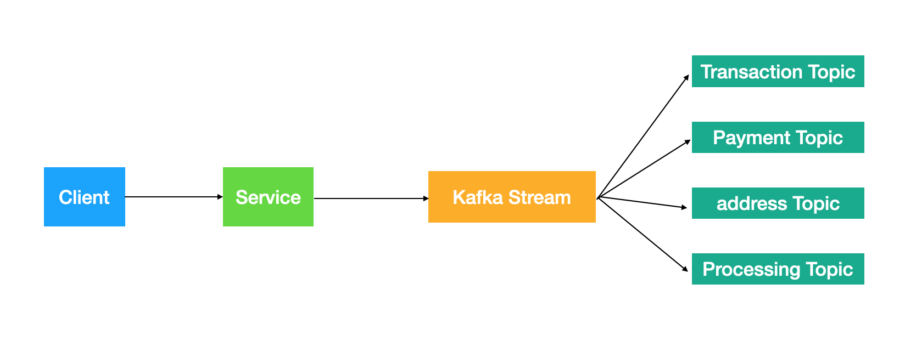

# kafkaStream

```
Sample request
{
	"from": "USD",
	"to": "EUR",
	"amount" : 200,
	"card" : {
		"cardNo": "4916159346318040567",
		"expDate":"02/24",
		"secCode":"123"
	},
	"address" : {
		"street" : "212 Third Ave",
		"city" : "New York",
		"zipCode": "01122",
		"country": "USA"
	}
}
```
